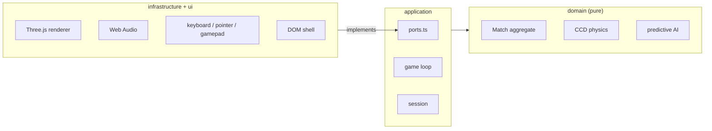

# Pong Arcade 3D

Pong rebuilt as a real 3D game: the paddles slide on the `x`/`y` plane and the ball travels down a `z`
tunnel between two goals. Plays in the browser, no install, no external assets.

**Live: [pong.naindev.com](https://pong.naindev.com)**

## What changed

This started as a 765-line single `index.html` holding CSS, DOM, physics, AI and rendering together. It is
now a 3D game split into layers, with the physics covered by tests that run without a browser. The original
version is preserved under [`legacy/`](legacy/).

| | v1 (2D) | v2 (3D) |
|---|---|---|
| Structure | one file, 765 lines | domain / application / infrastructure |
| Play | 2D canvas | 3D arena, paddles move on two axes |
| Collisions | discrete — tunnelled at speed | continuous (time-of-impact) |
| Opponent | followed the ball's `y` | solves the trajectory, wall bounces included |
| Loop | refresh-rate dependent | fixed 120 Hz + render interpolation |
| Tests | none | 109 |

## Architecture

Dependencies point inward. `domain` knows nothing about the browser, `application` defines the ports, and
`infrastructure` implements them. Only `main.ts` knows both sides exist.



The payoff is concrete: because the domain is pure and takes its randomness from an injected PRNG, a match is
reproducible from `(seed, input trace)`, and the physics is property-tested in Node.

Three decisions worth calling out:

- **Continuous collision detection.** The ball reaches 140 units/s while the paddle is 0.35 thick, so at a
  1/120 s step it moves further than the paddle in a single frame. The step solves the time of impact against
  every plane in chronological order instead of testing positions.
- **Fixed timestep with interpolation.** The simulation always advances in exact increments; the leftover time
  becomes the interpolation factor for rendering, so a 144 Hz display and a 60 Hz one play the same game.
- **Difficulty as human limitation.** The four opponents differ in reaction latency, aiming error and how
  early they commit — not in raw paddle speed. A faster opponent feels unfair; a late-reading one feels
  beatable.

See [`docs/adr/`](docs/adr/) for the full decision records.

## Play

| Action | Input |
|---|---|
| Move (player 1) | `W` `A` `S` `D`, arrow keys, mouse, or left stick |
| Move (player 2) | Arrow keys or `I` `J` `K` `L` |
| Pause | `Space` / `Esc` |
| Restart | `R` |
| Change camera | `C` |
| Mute | `M` |

Modes: single player, local two-player, and a CPU-vs-CPU demo. Cameras: chase, cockpit and broadcast.

## Development

```bash
npm install
npm run dev        # http://localhost:5173
npm test           # 109 tests
npm run check      # typecheck + tests + build
```

Source lives in `app/`; the build output (`index.html` + `assets/`) is written to the repository root because
GitHub Pages serves that directory directly and `CNAME` binds it to the custom domain.

```
app/src/domain/           pure engine — no DOM, no Three.js
app/src/application/      ports, fixed-timestep loop, session state machine
app/src/infrastructure/   Three.js, Web Audio, input, storage adapters
app/src/ui/               DOM shell and styles
tests/                    domain and application tests
scripts/publish.mjs       release pipeline
```

## Releasing

Publishing goes through a pull request, never a direct push to `main`, so every release is reviewable and
revertable from GitHub.

```bash
npm run deploy:check    # typecheck, test, build, commit the artefacts
npm run deploy:pr       # push the branch and open the PR
npm run deploy:merge    # squash-merge into main
npm run deploy:verify   # poll the live site until it serves this build
npm run release         # all of the above, end to end
```

`deploy:merge` and `release` publish to a public site, so they refuse to run without confirmation.

## Licence

MIT — NainDev ([naindev.com](https://www.naindev.com))
