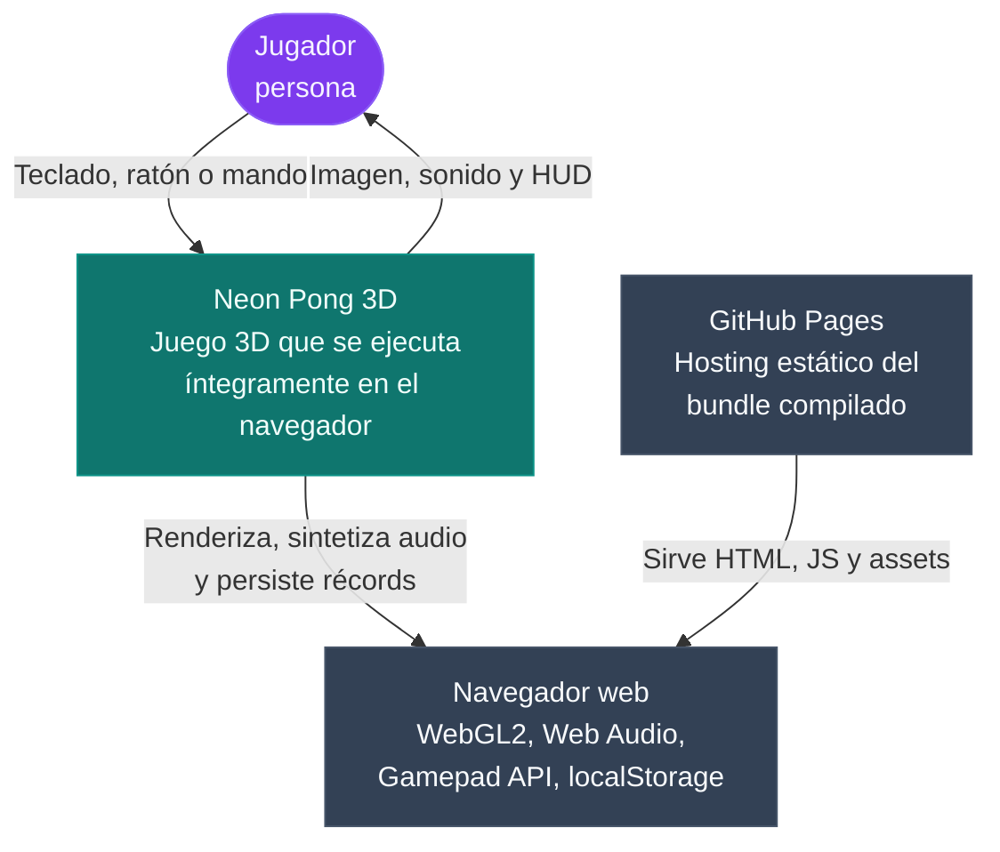
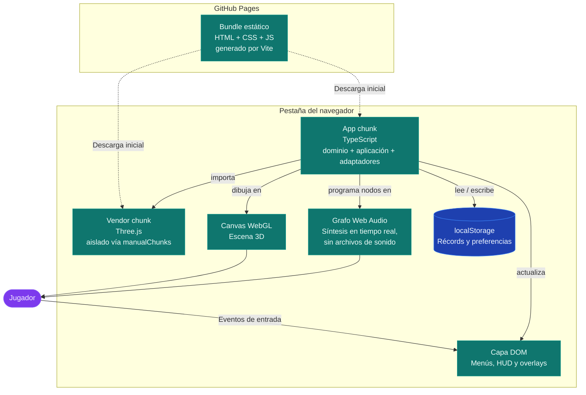
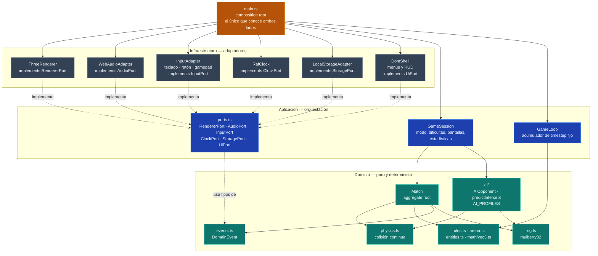
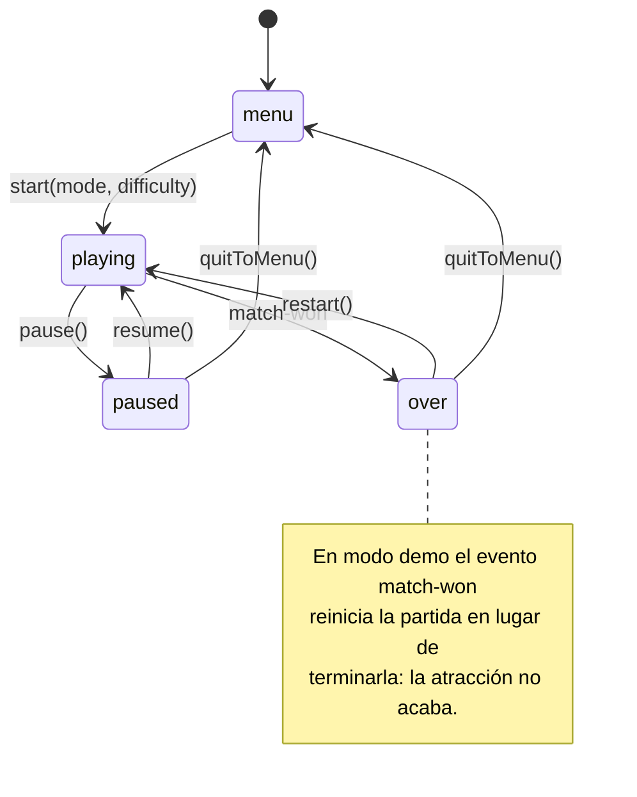

# Arquitectura — Neon Pong 3D

Vista del sistema siguiendo el **modelo C4** (niveles 1 a 3) y el recorrido
completo de un tick de simulación.

Las decisiones que justifican esta estructura están en los
[ADR](adr/README.md); este documento describe **qué hay**, no **por qué**.

---

## Nivel 1 — Contexto

Quién usa el sistema y de qué depende.



No hay backend, ni cuentas, ni telemetría: todo el estado vive en la pestaña del
navegador.

---

## Nivel 2 — Contenedores

Qué unidades desplegables componen el sistema y cómo se comunican.



---

## Nivel 3 — Componentes

El interior del *app chunk*. **Todas las flechas apuntan hacia dentro**: ningún
componente de una capa interior conoce a los de las exteriores.



### Regla de dependencia

| Capa | Puede importar de | Prohibido |
|------|-------------------|-----------|
| `src/domain/**` | solo de `src/domain` | `three`, DOM, `window`, `Math.random`, `Date.now` |
| `src/application/**` | `src/domain` | `three`, DOM, `window` |
| `src/infrastructure/**` | `src/application` (puertos) y tipos de `src/domain` | escribir reglas de juego |
| `src/main.ts` | todas | — |

Una violación de esta tabla es un error de arquitectura verificable, no una
cuestión de estilo.

---

## Un tick de simulación

Recorrido de un frame real: el reloj despierta el bucle, el bucle drena el
acumulador en pasos fijos de 1/120 s y, al final, dibuja el estado interpolado.

```mermaid
sequenceDiagram
    autonumber
    participant Clock as ClockPort · rAF
    participant Main as main.ts
    participant Input as InputPort
    participant Loop as GameLoop
    participant Session as GameSession
    participant Ai as AiOpponent
    participant Match as Match
    participant Renderer as RendererPort
    participant Audio as AudioPort
    participant Ui as UiPort

    Clock->>Main: onFrame(delta, elapsed)
    Main->>Input: sample()
    Note right of Input: Se muestrea una sola vez por frame:<br/>las acciones son de flanco y se<br/>consumirían dos veces dentro del bucle.
    Input-->>Main: InputFrame {near, far, actions}
    Main->>Main: aplica actions (pausa, cámara, audio)
    Main->>Loop: frame(delta, elapsed)

    loop mientras acumulador >= 1/120 s
        Loop->>Main: update(dt)
        Main->>Session: step(dt, intents)
        Session->>Ai: intent(ball, paddle, dt)
        Note right of Ai: Solo replanifica cada reactionDelay;<br/>entre medias se compromete con su lectura.
        Ai-->>Session: PaddleIntent
        Session->>Match: step(dt, intents resueltos)
        Match->>Match: advancePaddle · advanceBall (CCD)
        Match-->>Session: DomainEvent[]
        Session->>Session: actualiza récords y pantalla
        Session-->>Main: DomainEvent[]
        Main->>Renderer: handleEvents(events)
        Main->>Audio: handleEvents(events)
    end

    Loop->>Main: render(alpha, delta, elapsed)
    Main->>Renderer: render({previous, current, alpha, time, delta, dimmed})
    Main->>Ui: render(HudView)
    Renderer-->>Main: fps
```

Puntos que el diagrama hace explícitos:

- El **dominio nunca es llamado por la infraestructura**. `main.ts` recoge los
  eventos y los reparte; el `Match` no sabe que existe un renderer.
- Los `DomainEvent` son el **único** canal de notificación. Si el audio necesita
  saber que hubo un golpe en el borde de la pala, ese dato viaja en el evento
  (`edge: true`), no se deduce inspeccionando la física.
- El render ocurre **una vez por frame**, con `alpha`; la simulación ocurre
  **0..n veces por frame**, siempre con el mismo `dt`.

---

## Máquina de estados de pantalla

`GameSession` es la dueña de esta transición; `UiPort` solo la refleja.


